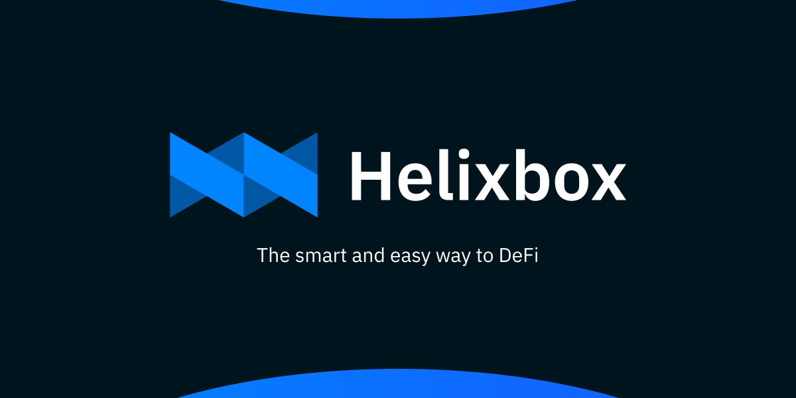

# Brand & Assets

## Brand Overview

Helixbox represents innovation, security, and accessibility in DeFi. Our brand elements are designed to convey trust, technology, and user-friendliness.

## Full Logo & Assets

- [Download SVG →](./assets/logo.svg)
- [Download PNG →](./assets/logo.png)
- [Download Dark →](./assets/logo-rect.png)
- [Download With Label →](./assets/logo&label.png)
- [Download all assets](./assets/Brand.zip)

  

  

  

 

