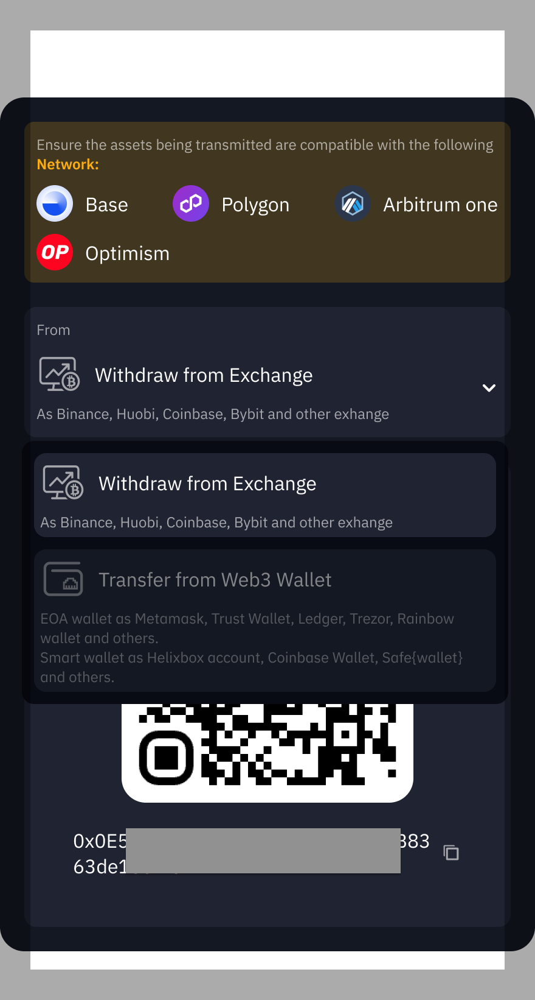
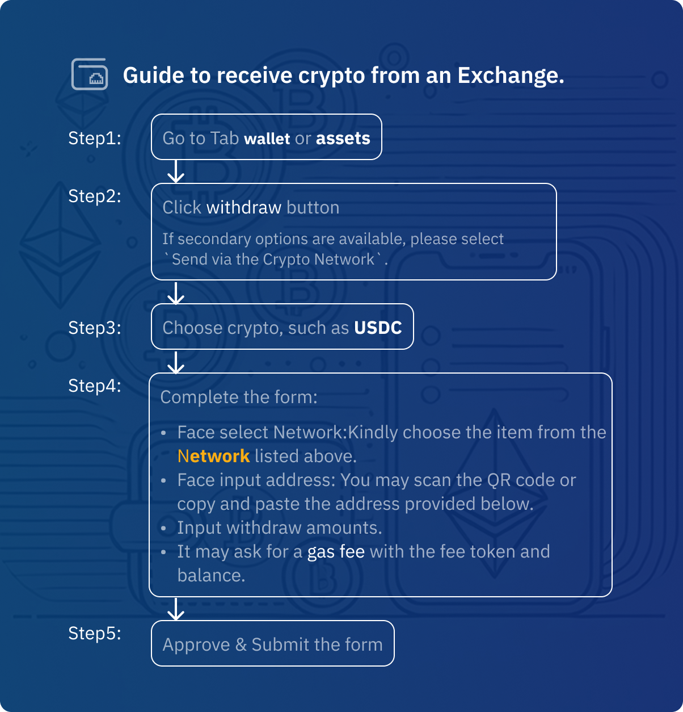
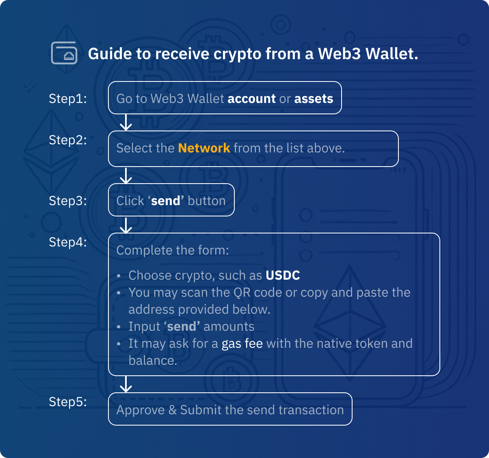

import Tabs from '@theme/Tabs';
import TabItem from '@theme/TabItem';

# Add Funds to Your Account

:::note Important
Before making any deposit, please ensure you:
  - [Understand the fees](#fees)
  - Select the [correct network](#payment-methods)
  - Review [transaction limits](#limits)

Looking to withdraw? See our [Cash Out Guide](./cash-out-crypto)

::: 

## How to Add Funds

<Tabs>
<TabItem value="crypto" label="Crypto Deposit">
  
  1. Login with [helix.box/overview](http://helix.box/overview) from a browser on your computer.
  2. Click the **Receive** button at overview page or directly visit [helix.box/receive](http://helix.box/receive) from a browser on your computer.
  3. Select a way to deposit **Withdraw from Exchange** or **Transfer from Web3 Wallet**
    <Tabs>
      <TabItem value="exchange" label="Withdraw from Exchange">
        
      </TabItem>  
       <TabItem value="we3-wallet" label="Transfer from Web3 Wallet">
         
      </TabItem>  
    </Tabs>
</TabItem>

<TabItem value="card" label="Card Payment">

1. Select "Card Payment" method
2. Enter the amount
3. Fill in your card details
4. Complete 3D-Secure verification if required
5. Confirm the transaction

:::tip
Save your card securely for future purchases
:::
</TabItem>

<TabItem value="bank" label="Bank Transfer">

1. Choose "Bank Transfer"
2. Select your region and currency
3. Get bank account details
4. Make the transfer from your bank
5. Add reference number to your transfer

:::info
Bank transfers may take 1-3 business days to process
:::
</TabItem>
</Tabs>

## Transaction Limits {#limits}

| Method | Minimum | Maximum | Processing Time |
|--------|----------|----------|-----------------|
| Crypto | Network Min | No Limit | Network Speed |
| Card | $20 | $5,000/day | Instant |
| Bank | $100 | $50,000/day | 1-3 days |
:::warning Security Best Practices
  - ⛑️ Always double-check the network and address before sending
  - 🔍 Verify first/last 5 characters of deposit addresses
  - ⚠️ Watch for phishing - Always check domain is https://helix.box
  - 📧 Never share private keys or seed phrases via email
  - 🦶 View real-time fee calculations before confirming any transaction
  - 📈 After depositing, track your transaction through:
    1. **Blockchain Explorers** Click transaction hash to view on chain-specific explorers
    2. **Transaction history** (coming soon)
    3. **Email Alerts** (coming soon)
:::

 

## Fees

- Crypto deposits: Network fees only
- Card payments: 2.5% processing fee
- Bank transfers: Varies by region

## Supported Networks & Tokens {#supported-networks}
- Supported networks: 
  -  Base
  -  Arbitrum one
  -  Polygon
  -  Optimism
- Supported token: 
  1. Auto-recognition for all ERC20 standard tokens
  2. Custom token support (via contract address)
  3. Cross-chain auto-conversion for major stablecoins (USDT/USDC/DAI)

### What's Next?
- [🔐 Privacy & Security](./privacy-security) - Helixbox's privacy policies, security
- [💳 Smart Wallet vs EOA](/docs/faqs/smart-wallet-faq)
- [🔄 Swap](/docs/swap) - Token exchange and trading
- [⚡ Bridge](/docs/bridge) - Cross-chain transfers
- [❓ FAQs](/docs/faqs/smart-wallet-faq) - Common questions and answers

