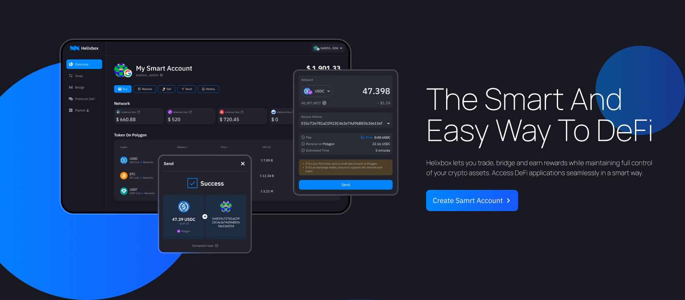
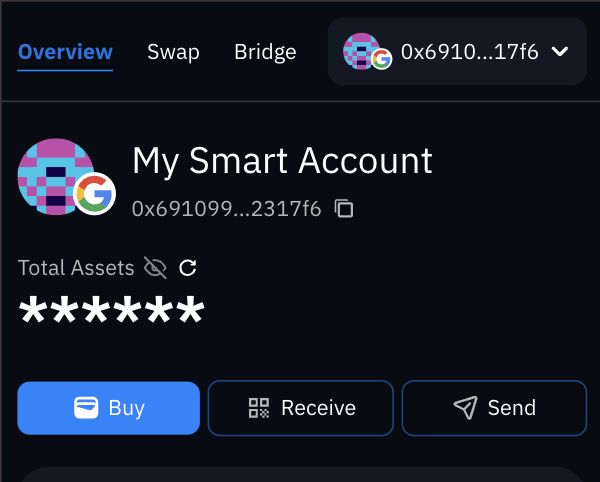
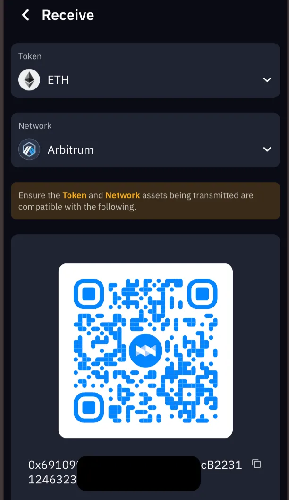

# Getting Started

 

## Create a Heilxbox account 

1. Visit [app.helix.box](http://app.helix.box) from a browser on your computer.

2. Select **Create smart account** or **Sign in** on the Helix.box homepage.

3. Select a way to create your smart wallet for **Free**

import Tabs from '@theme/Tabs';
import TabItem from '@theme/TabItem';

<Tabs>
  <TabItem value="email" label="Email">
  &nbsp; 3.a. Enter your email address and select **Submit**  
  &nbsp; 3.b. Enter the verification code sent to your email address and select **Continue**
  </TabItem>
  <TabItem value="google" label="Google Auth">
    &nbsp; 3.a. Select **Google**  
    &nbsp; 3.b. Choose a Google Account and allow the access
  </TabItem>
  <TabItem value="wallet" label="Continue with a Wallet">
    &nbsp; 3.a. Select a wallet connect provider  
    &nbsp; 3.b. Sign message to approve account creation
  </TabItem>
</Tabs>

4. Welcome to Helixbox then follow the onboarding panel to **Continue**.

 

## How to get your Smart Wallet Address

To get your wallet address from Helixbox, you can use any of these methods:

<Tabs>
  <TabItem value="overview" label="From Overview Page">
    1. Login with [app.helix.box/overview](http://app.helix.box/overview) from a browser on your computer.

    2. Click the **Overview** tab in the navigation bar (Mobile: tap the list icon at the top-left).

    3. At the top of the page, next to the avatar, click the **copy icon** next to the sentence starting with "0x" followed by hexadecimal characters, like `0x5AbFc6...ed004b`.

    
  </TabItem>

  <TabItem value="receive" label="Using Receive Page">
    1. Click the **Receive** button at overview page or directly visit [app.helix.box/receive](http://app.helix.box/receive) from a browser on your computer.

    2. Next to the QR code, it shows the full address.

  
  </TabItem>

  <TabItem value="avatar" label="From Avatar Menu">
    1. Login with [app.helix.box/overview](http://app.helix.box/overview) from a browser on your computer.

    2. At the navigation bar, click the **Avatar button**.

    3. Next to the avatar, click the **copy icon** next to the sentence starting with "0x" followed by hexadecimal characters, like `0x5AbFc6...ed004b`.

   
  </TabItem>
</Tabs>

### Smart Wallet Address: Your Unique ID in the EVM Universe

In the Ethereum Virtual Machine (EVM) ecosystem, a **wallet address** is a unique identifier for each user or smart contract. It acts as an "account number" for interacting with the blockchain, used for sending and receiving tokens, executing smart contracts, and other operations.

Here are some key points about wallet addresses:

1. **Uniqueness**: Each wallet address is unique, ensuring that no two addresses are the same across the entire blockchain network. This uniqueness allows each user or contract to be accurately identified.

2. **Format**: EVM wallet addresses typically start with "0x," followed by 40 hexadecimal characters (a total of 20 bytes), for example, `0x5AbFc6C4E52e1eA1f8eC7D355A3b2D7F4ded004b`.

3. **Access Control**: Wallet addresses are not only used to identify accounts but are also associated with cryptographic keys. Users who possess the corresponding private key can control the assets under that address and make transactions.

4. **Ecosystem Compatibility**: EVM wallet addresses are compatible with Ethereum and other EVM-compatible blockchains (such as Binance Smart Chain, Polygon, etc.), allowing users to seamlessly transfer assets between different chains.

5. **Transaction Records**: All transaction records associated with that address are securely stored on the blockchain, and anyone can access them. This feature enhances transparency and security.

In summary, wallet addresses serve as unique identity markers within the EVM ecosystem, enabling users to securely manage assets and conduct transactions while interacting with other users and smart contracts.

<h2>Why Passkey? Seamlessly login cross Device</h2>

Content coming soon

## Smart Wallet or EOA

Content coming soon

