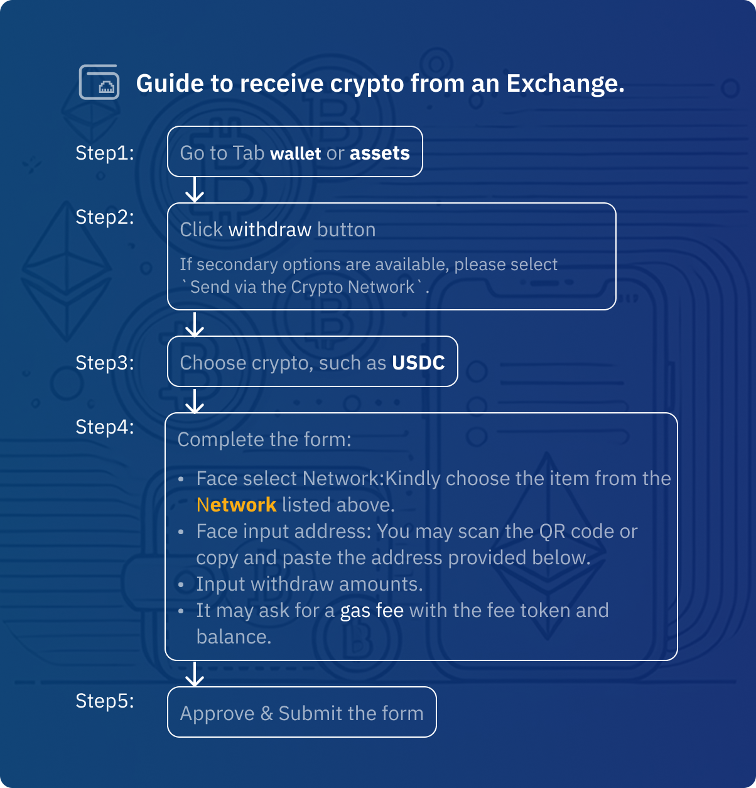
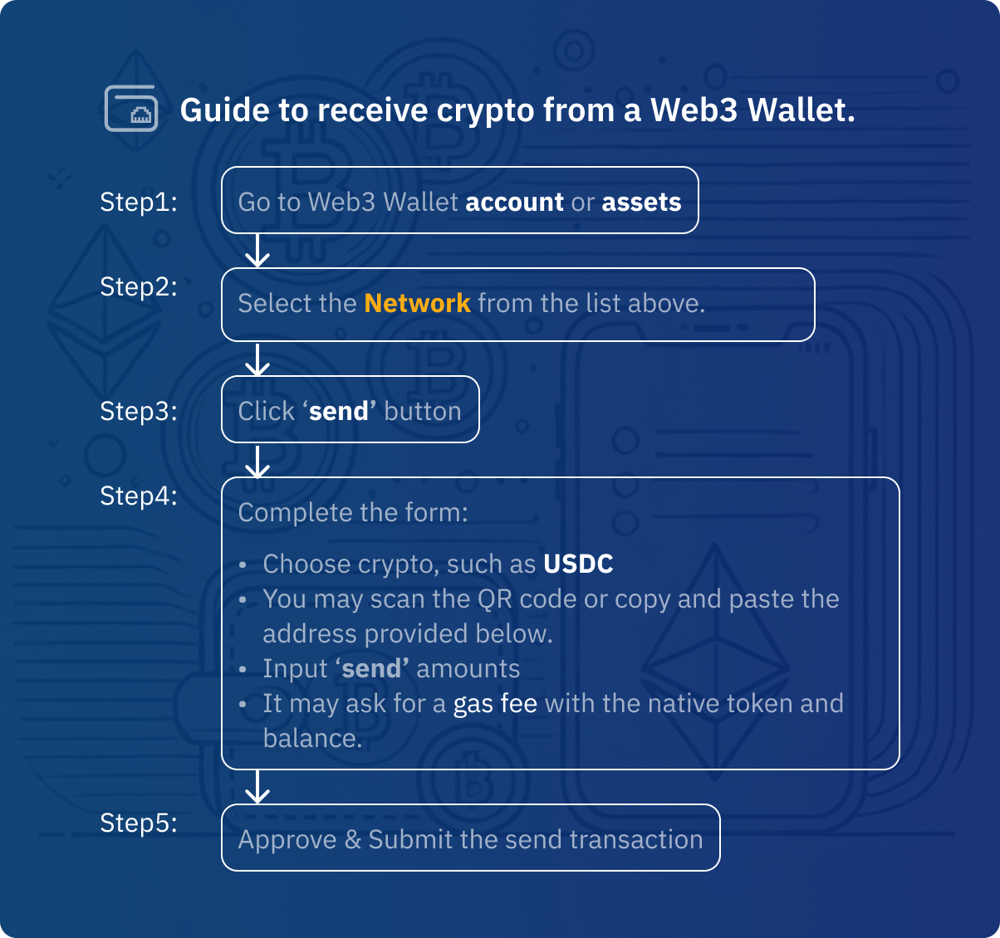

import Tabs from '@theme/Tabs';
import TabItem from '@theme/TabItem';

# Add Funds to Your Account

## How to Add Funds?

<Tabs>
<TabItem value="crypto" label="Receive Crypto" default>
  ### Receive Crypto
  1. **Login**: Visit [https://helixbox.ai/overview](https://helixbox.ai/overview) using a desktop browser.
  2. **Navigate to Receive**: Click the **Receive** button on the overview page, or go directly to [https://helixbox.ai/receive](https://helixbox.ai/receive).
  3. **Select Asset**: Choose a cryptocurrency and confirm network compatibility.
  4. **Copy Address**:  
    - Click the copy icon next to your wallet address.
    - Alternatively, scan the QR code.
    
  5. **Select Receive Method**:  
    <Tabs>
      <TabItem value="exchange" label="Exchange">
        ### Receive Crypto from Exchange
        
      </TabItem>  
       <TabItem value="web3-wallet" label="Web3 Wallet">
        ### Receive Crypto from Web3 Wallet
         
      </TabItem>  
    </Tabs>
</TabItem>

<TabItem value="card" label="Card Payment">
  ### Card Payment (Coming Soon)
</TabItem>

<TabItem value="bank" label="Bank Transfer">
  ### Bank Transfer (Coming Soon)
</TabItem>
</Tabs>

:::tip Security Best Practices
Before making any asset funding (buying or receiving crypto), please ensure:
- 🔒 You double-check and confirm the receive [wallet address](/docs/introduction/getting-started/#smart-wallet-address).
  1. Verify the first and last 5 characters of deposit addresses. 
  2. Confirm the domain is [https://helixbox.ai](https://helixbox.ai).
- 🔍 You select the [supported networks](#supported-networks) for transfers.
- ⏱️ You review the real-time [fees](#fees), which include network, service, handling, and exchange rates.
- 📧 Never share private keys or seed phrases.
- 📊 Track transactions through:
    1. **Blockchain Explorers** (via transaction hash).
    2. **Transaction History** (coming soon).
    3. **Email Alerts** (coming soon).

For withdrawals (cashing out or sending crypto), see our [Cash Out Guide](./cash-out-crypto).
::: 

##  Transaction Limits {#transaction-limits}

| Method  | Minimum     | Maximum          | Processing Time       |
|---------|-------------|------------------|-----------------------|
| Crypto  | Network Min | No Limit         | Network Congestion    |
| Card    | $20         | $5,000/day       | Instant               |
| Bank    | $100        | $50,000/day      | 1-3 business days     |

## Fees
- **Receive Crypto**: Network fees only.
- **Card Payments**: 2.5% processing fee.
- **Bank Transfers**: Varies by region (0.5%-1.5%).

## Supported networks {#supported-networks}

  

    
    Base
  

  
  

    
    Arbitrum One
  

  

    
    Polygon
  

  

    
    Optimism
  

:::note Network Compatibility
Always confirm that the token contract address matches the selected network. Cross-chain transfers require bridge functionality.
:::

### Supported Tokens
- **Auto-Recognized Tokens**
  - All ERC-20 standard tokens.
  - Native network tokens (ETH, MATIC, etc.).
  - Major stablecoins (USDT, USDC, DAI).

- **Custom Tokens**
  - Add via contract address.
  - Manual verification required. Example: `0x...` 

### What's Next?
- [🔐 Privacy & Security](/docs/introduction/privacy-security) - Helixbox's privacy policies, security
- [💳 Smart Wallet vs EOA](/docs/faqs/smart-wallet-faq)
- [🔄 Swap](/docs/swap) - Token exchange and trading
- [⚡ Bridge](/docs/bridge) - Cross-chain transfers
- [❓ FAQs](/docs/faqs/smart-wallet-faq) - Common questions and answers

