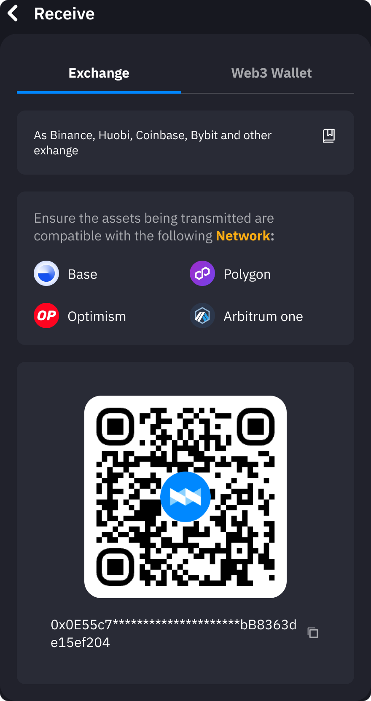

import Tabs from '@theme/Tabs';
import TabItem from '@theme/TabItem';

# Add Funds to Your Account

:::note Important
Before making any deposit, please ensure:
- You [understand the fees](#fees)
- You select the [correct network](#supported-networks)
- You review [transaction limits](#transaction-limits)

For withdrawals, see our [Cash Out Guide](./cash-out-crypto)
::: 

## How to Add Funds

<Tabs>
<TabItem value="crypto" label="Crypto Deposit" default>
  
  1. **Login**: Visit [https://helix.box/overview](https://helix.box/overview) using a desktop browser
  2. **Navigate to Receive**: Click the **Receive** button on the overview page, or go directly to [https://helix.box/receive](https://helix.box/receive)
  3. **Select Asset**: Choose cryptocurrency and confirm network compatibility
  4. **Copy Address**:  
    - Click the copy icon next to your wallet address
    - Alternatively, scan the QR code
  5. **Select Deposit Method**:  
    <Tabs>
      <TabItem value="exchange" label="Withdraw from Exchange">
        
      </TabItem>  
       <TabItem value="web3-wallet" label="Transfer from Web3 Wallet">
         
      </TabItem>  
    </Tabs>
</TabItem>

<TabItem value="card" label="Card Payment">
  ### Coming Soon
  Currently only available through Coinbase integration

  :::tip
  Save your card securely for future purchases
  :::
</TabItem>

<TabItem value="bank" label="Bank Transfer">
  ### Coming Soon
  Currently only available through Coinbase integration
</TabItem>
</Tabs>

## Transaction Limits {#transaction-limits}

| Method  | Minimum     | Maximum          | Processing Time       |
|---------|-------------|------------------|-----------------------|
| Crypto  | Network Min | No Limit         | Network Congestion    |
| Card    | $20         | $5,000/day       | Instant               |
| Bank    | $100        | $50,000/day      | 1-3 business days     |
:::warning Security Best Practices
  - 🔒 Always double-check network and address before sending
  - 🔍 Verify first/last 5 characters of deposit addresses
  - 🌐 Confirm domain is [https://helix.box](https://helix.box)
  - 📧 Never share private keys or seed phrases
  - ⏱️ View real-time fee calculations before confirming
  - 📊 Track transactions through:
    1. **Blockchain Explorers** (via transaction hash)
    2. **Transaction History** (coming soon)
    3. **Email Alerts** (coming soon)
:::

 

## Fees

- **Crypto Deposits**: Network fees only
- **Card Payments**: 2.5% processing fee
- **Bank Transfers**: Varies by region (0.5%-1.5%)

## Supported Networks & Tokens {#supported-networks}

### networks

  

    
    Base
  

  
  

    
    Arbitrum One
  

  

    
    Polygon
  

  

    
    Optimism
  

### Tokens
- **Auto-Recognized Tokens**
  - All ERC-20 standard tokens
  - Native network tokens (ETH, MATIC, etc.)
  - Major stablecoins (USDT, USDC, DAI)

- **Custom Tokens**
  - Add via contract address
  - Manual verification required
  - Example: `0x...` 

:::tip Network Compatibility
Always confirm the token contract address matches the selected network. Cross-chain transfers require bridge functionality.
:::

### What's Next?
- [🔐 Privacy & Security](/docs/introduction/privacy-security) - Helixbox's privacy policies, security
- [💳 Smart Wallet vs EOA](/docs/faqs/smart-wallet-faq)
- [🔄 Swap](/docs/swap) - Token exchange and trading
- [⚡ Bridge](/docs/bridge) - Cross-chain transfers
- [❓ FAQs](/docs/faqs/smart-wallet-faq) - Common questions and answers

