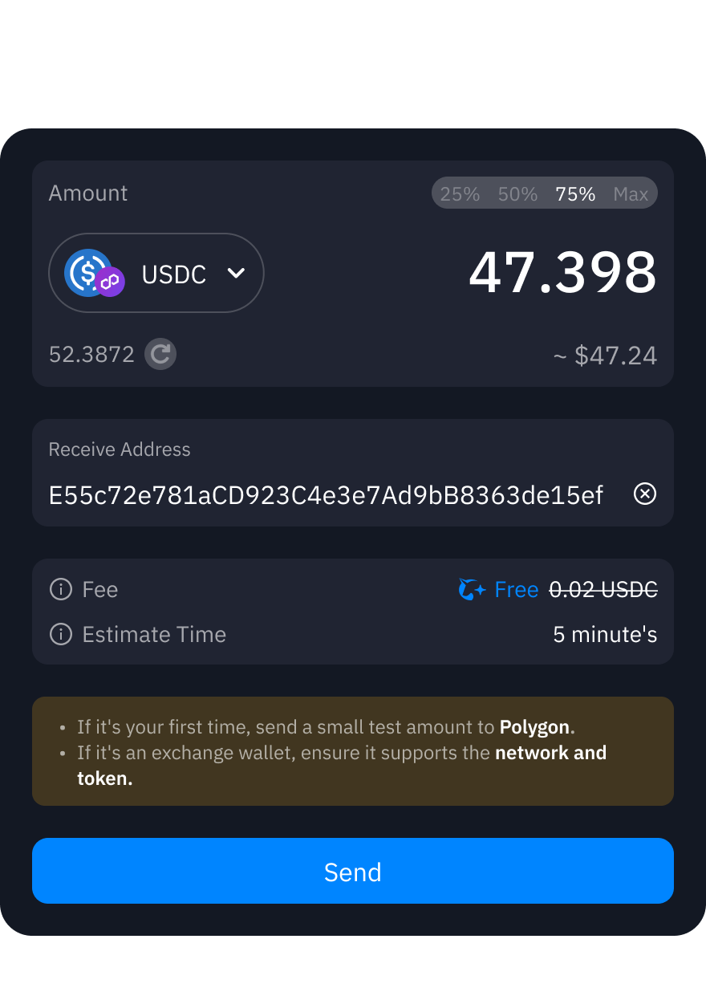

import Tabs from '@theme/Tabs';
import TabItem from '@theme/TabItem';

# Cash Out My Crypto

  

  ## Cash Out My Crypto
  

  Coming soon

  

    ## Send Crypto to Other Wallets
  

  Withdrawal Crypto from Helixboxx
  
  
  1. **Login**: Visit [https://helix.box/overview](https://helix.box/overview) using a desktop browser.
  2. **Navigate to Send**: Click the **Send** button on the overview page, or go directly to [https://helix.box/send](https://helix.box/send).
  3. **Select Asset**: Choose a cryptocurrency and confirm network compatibility.
  4. **Enter Details**: Specify the amount (must exceed the network minimum)
  5. **Enter Recipient**: Input the recipient wallet address.
  6. **Review & Confirm**:
     - Check [network fees](#fee-processing-times).
     - Verify the estimated processing time.
     - Submit the transaction.
  7. **Authentication**: (WalletConnect only) Sign the transaction in the connected wallet.

## Withdrawal Limits

| Method  | Minimum     | Maximum          | Processing Time       |
|---------|-------------|------------------|-----------------------|
| Crypto  | Network Min | Account Balance  | Network Congestion    |
| Fiat    | $--        | --/day      | 1-3 business days     |

## Fees & Processing Times {#fee-processing-times}

### Crypto Transactions
- 🔹 Dynamic network fees based on real-time congestion.
- 🔸 Fee preview before transaction confirmation.
- 🔹 Typical confirmation times:
  - Base: \<5 minutes
  - Arbitrum: \<3 minutes
  - Polygon: \<7 minutes
  - Optimism: \<5 minutes

:::warning Security Protocols
  - 🔒 Always verify:
    - The recipient wallet supports both the **network** and the **token**.
    - The first and last 5 characters of wallet addresses match.
    - HTTPS certificate (https://helix.box).
   - 📈 After sending, track your transaction through:
    1. **Blockchain Explorers:** Click the transaction hash to view on chain-specific explorers.
    2. **Transaction history** (coming soon).
    3. **Email Alerts** (coming soon).
:::

## Supported Networks & Tokens {#supported-networks}

### Networks

  

    
    Base
  

  
  

    
    Arbitrum One
  

  

    
    Polygon
  

  

    
    Optimism
  

### Tokens
- **Auto-Recognized Tokens**
  - All ERC-20 standard tokens.
  - Native network tokens (ETH, MATIC, etc.).
  - Major stablecoins (USDT, USDC, DAI).

- **Custom Tokens**
  - Add via contract address.
  - Manual verification required.
  - Example: `0x...` 

:::tip Network Compatibility
Always confirm that the token contract address matches the selected network. Cross-chain transfers require bridge functionality.
:::

### What's Next?
- [🔐 Privacy & Security](/docs/introduction/privacy-security) - Helixbox's privacy policies, security
- [💰 Add Funds](/docs/funding/add-funds) - Buy and deposit crypto assets
- [🔄 Swap](/docs/swap) - Token exchange and trading
- [⚡ Bridge](/docs/bridge) - Cross-chain transfers
- [❓ FAQs](/docs/faqs/smart-wallet-faq) - Common questions and answers

:::tip Need Help?
Can't find what you're looking for? Join our [Discord Community](https://discord.gg/6XyyNGugdE) for support!
:::