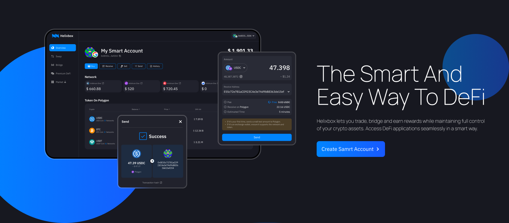
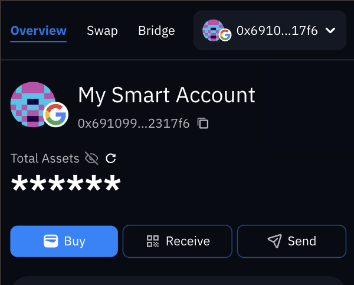
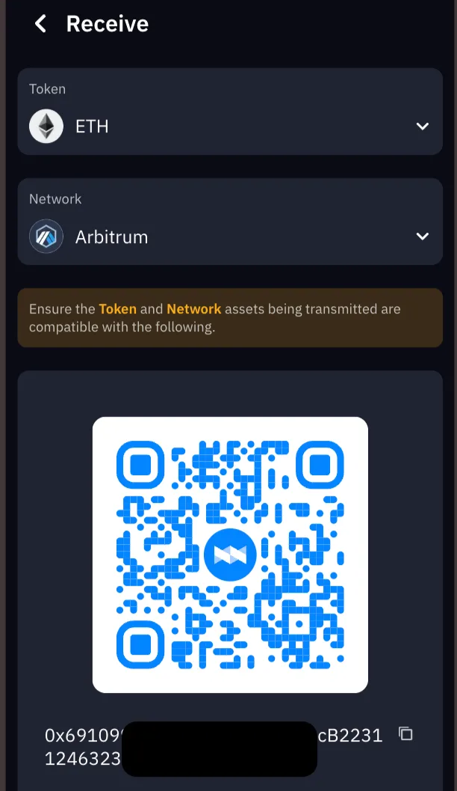
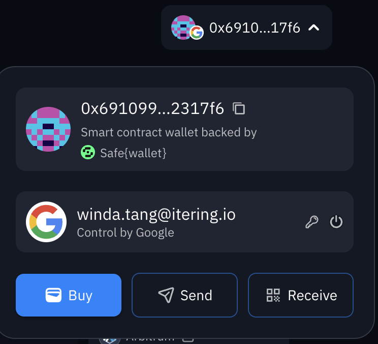
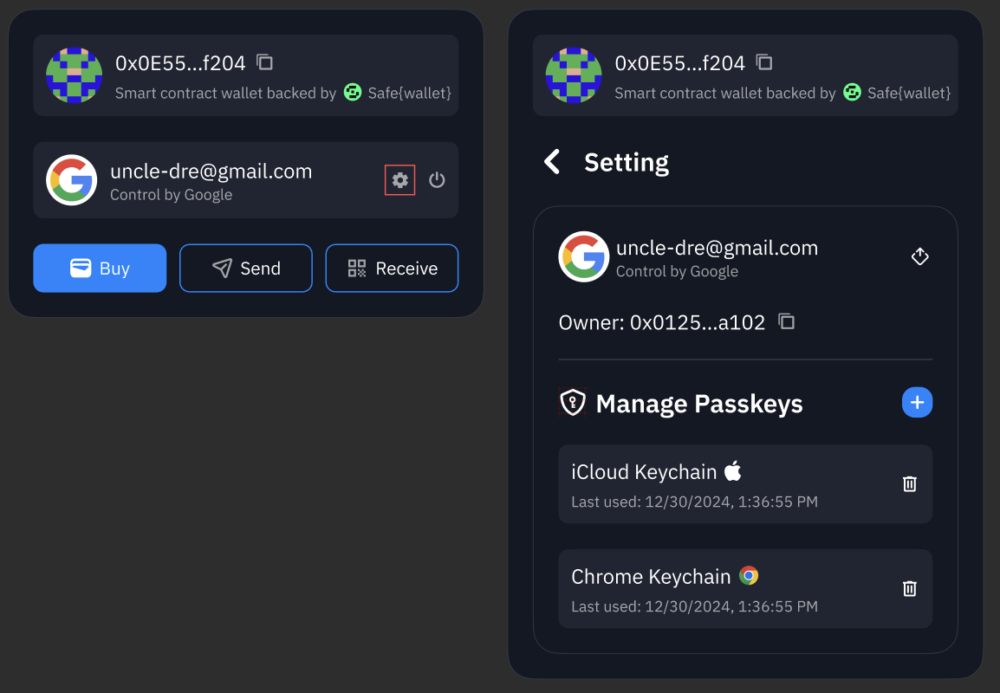

# Getting Started

Join the smart and easy way to DeFi! An instant multichain ecosystem for secure asset management.

 

 

## Create Account {#create-account}

1. Visit [helix.box](https://helix.box) from a desktop browser
2. Select **Create smart account** or **Sign in** on the homepage
3. Choose a wallet creation method:

import Tabs from '@theme/Tabs';
import TabItem from '@theme/TabItem';

<Tabs>
  <TabItem value="email" label="Email">
    3a. Enter your email address and select **Submit**  
    3b. Enter the verification code sent to your email
  </TabItem>
  <TabItem value="google" label="Google Auth">
    3a. Select **Continue with Google**  
    3b. Choose a Google Account
  </TabItem>
  <TabItem value="wallet" label="Wallet Connect">
    3a. Select a wallet provider  
    3b. Sign the approval message
  </TabItem>
</Tabs>

4. Welcome to Helixbox, complete the onboarding process to **Continue**.

## How to get your Smart Wallet Address？{#smart-wallet-address}

To get your wallet address from Helixbox, you can use any of these methods:

<Tabs>
  <TabItem value="overview" label="From Overview Page">
    1. **Login**: Visit [https://helix.box/overview](https://helix.box/overview) using a desktop/mobile browser
    2. **Navigate to Overview**: Click the **Overview** tab in the navigation bar (Mobile: tap the list icon at the top-left).
    3. At the top of the page, next to the avatar, click the **copy icon** next to the sentence starting with "0x" followed by hexadecimal characters, like `0x5AbFc6...ed004b`.

    
  </TabItem>

  <TabItem value="receive" label="Using Receive Page">
    1. Click the **Receive** button at overview page or directly visit [helix.box/receive](http://helix.box/receive) from a browser on your computer.

    2. Next to the QR code, it shows the full address.

  
  </TabItem>

  <TabItem value="avatar" label="From Avatar Menu">
    1. **Login**: Visit [https://helix.box/overview](https://helix.box/overview) using a desktop/mobile browser
    2. At the navigation bar, click the **Avatar button**.
    3. Next to the avatar, click the **copy icon** next to the sentence starting with "0x" followed by hexadecimal characters, like `0x5AbFc6...ed004b`.

   
  </TabItem>
</Tabs>

### Smart Wallet Address: Your Unique ID in the EVM Universe

In the Ethereum Virtual Machine (EVM) ecosystem, a **wallet address** is a unique identifier for each user or smart contract. It acts as an "account number" for interacting with the blockchain, used for sending and receiving tokens, executing smart contracts, and other operations.

Here are some key points about wallet addresses:

1. **Uniqueness**: Each wallet address is unique, ensuring that no two addresses are the same across the entire blockchain network. This uniqueness allows each user or contract to be accurately identified.

2. **Format**: EVM wallet addresses typically start with "0x," followed by 40 hexadecimal characters (a total of 20 bytes), for example, `0x5AbFc6C4E52e1eA1f8eC7D355A3b2D7F4ded004b`.

3. **Access Control**: Wallet addresses are not only used to identify accounts but are also associated with cryptographic keys. Users who possess the corresponding private key can control the assets under that address and make transactions.

4. **Ecosystem Compatibility**: EVM wallet addresses are compatible with Ethereum and other EVM-compatible blockchains (such as Binance Smart Chain, Polygon, etc.), allowing users to seamlessly transfer assets between different chains.

5. **Transaction Records**: All transaction records associated with that address are securely stored on the blockchain, and anyone can access them. This feature enhances transparency and security.

In summary, wallet addresses serve as unique identity markers within the EVM ecosystem, enabling users to securely manage assets and conduct transactions while interacting with other users and smart contracts.

## Why Passkey? Seamlessly log in cross-device {#passkeys}

Passkeys represent the next generation of authentication, offering a more secure and convenient alternative to traditional passwords. At Helixbox, we've implemented passkey support to provide you with a seamless and secure login experience across all your devices.

### How to Use Passkeys with Helixbox

1. **Setting Up Passkeys**
   - During account creation, at welcome panel you'll be prompted to create a passkey
   - Follow your device's prompts to save the passkey using your preferred authentication method
   - Your passkey will be automatically synchronized across your devices

2. **Logging In with Passkeys**
   - Click "Sign in" on the Helixbox homepage
   - Select the passkey option
   - Authenticate using your device's biometric sensor or PIN
   - You're securely logged in!

3. **Manage Passkeys**
   - Access your account settings by clicking on your controller avatar in the top right corner
   - In the Manage Passkeys section, you can:
     - View all registered passkeys
     - Add a new passkey
     - Remove existing passkeys   
    

### What are Passkeys?

Passkeys are cryptographic credentials that:
- Replace traditional passwords
- Are unique to each website
- Cannot be reused, phished, or leaked
- Your passkeys are automatically backed up and synchronized through your device's cloud service (iCloud, Google Password Manager, etc.)

### Benefits of Using Passkeys

1. **Enhanced Security**
   - Biometric authentication (Face ID, Touch ID, or fingerprint)
   - Resistant to phishing attempts
   - No passwords to remember or potentially leak

2. **Seamless Cross-Device Experience**
   - Sign in easily across all your devices
   - Automatic synchronization through your device's cloud service
   - Works across different operating systems and browsers

3. **Faster Login Process**
   - No need to remember or type passwords
   - Quick biometric verification
   - Automatic device recognition

### Supported Platforms

Passkeys work across:
- iOS 16+ devices
- Android 9+ devices
- macOS Ventura and later
- Windows 10 and 11
- Major browsers (Chrome, Safari, Firefox, Edge)

### What's Next?
- [🔐 Privacy & Security](/docs/introduction/privacy-security) - Helixbox's privacy policies, security
- [💰 Add Funds](/docs/funding/add-funds) - Buy and deposit crypto assets
- [🔄 Swap](/docs/swap) - Token exchange and trading
- [⚡ Bridge](/docs/bridge) - Cross-chain transfers
- [❓ FAQs](/docs/faqs/smart-wallet-faq) - Common questions and answers

:::tip Need Help?
Can't find what you're looking for? Join our [Discord Community](https://discord.gg/6XyyNGugdE) for support!
:::
