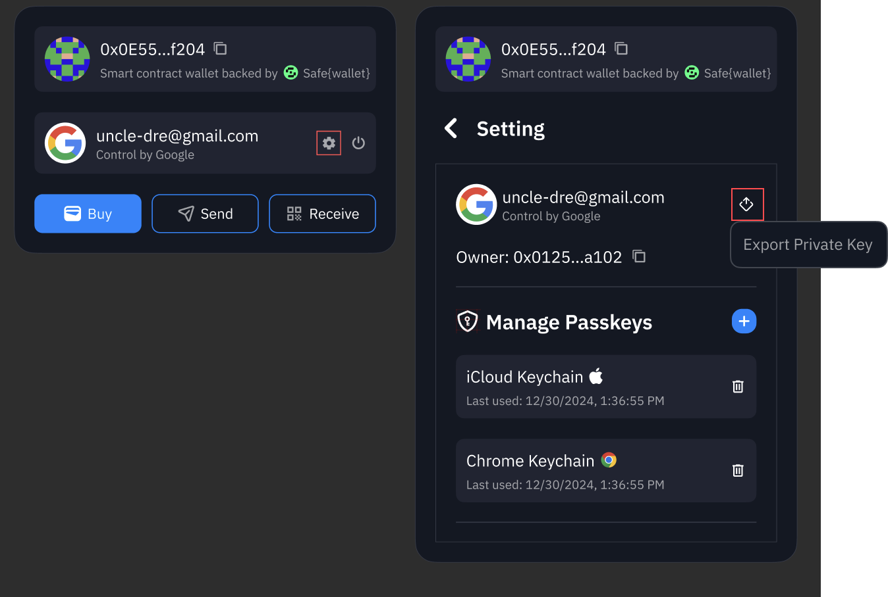

# Export Smart Wallet

Helixbox uses a combination of technologies to provide a secure and user-friendly wallet experience:
- **Privy**: For secure wallet infrastructure and authentication
- **Safe\{Wallet\}**: For smart contract wallet implementation
- **EOA Wallet**: As the owner of your Smart Wallet
:::note[Disclaimer]
Helixbox does not store or manage any account information. Our wallet system is powered by Privy. 
For more details about the security architecture and implementation,
please visit [Privy's Security Documentation](https://docs.privy.io/guide/security/).
:::

## Wallet Architecture

Your Helixbox wallet combines:
1. **Base EOA Wallet** (Owner)  
   Controls the Smart Wallet
2. **Smart Wallet** (Safe\{Wallet\})  
   Manages assets and transactions

:::tip[backup or recovery]
No backup or recovery is needed as your wallet is secured by your EOA wallet or credentials through Privy.
:::

## Advanced Operations

### Smart Wallet Owner Address

:::note
follow feature only works with email or Google account login. Wallet Connect is not supported.
:::
To get your Smart Wallet owner address:
1. Access your account settings by clicking on your avatar in the top right corner
2. The address following your login provider is your Smart Wallet owner address
3. You can click the copy icon to copy the address

:::tip
Most users don't need to export their wallet. Helixbox provides all necessary features for secure asset management.
:::

### Exporting [Smart Wallet Owner]'s Private Key 

For advanced users who want to manage their Smart Wallet directly through Safe\{Wallet\}:
1. Access your account settings by clicking on your avatar in the top right corner
2. Click on "**Export Private Key**" in the menu
3. A secure modal will appear where you can:
   - View and copy your private key
   - View and copy your seed phrase

:::danger[Important!!!]
- Never share your private key or seed phrase with anyone
- Make sure you are in a secure environment before exporting
- Store your private key and seed phrase safely offline
:::

### Changing Smart Wallet Owner

:::caution
Changing ownership has important consequences:
- May lose access to your wallet through Helixbox
- Cannot use Helixbox features after ownership change
- Transaction history may become inaccessible
- Account recovery through Privy will no longer work
Only proceed if you fully understand the consequences.
:::

You can change your Smart Wallet's owner through Safe\{Wallet\}:

1. Visit [Safe\{Wallet\} App](https://app.safe.global)
2. Connect using your exported private key
3. Navigate to Settings > Owners
4. Follow Safe\{Wallet\}'s owner management process

#### Security Considerations

1. **Before Exporting**:
   - Ensure you understand the risks
   - Have a secure storage solution ready
   - Know how to use Safe\{Wallet\}

2. **After Exporting**:
   - Store private key securely
   - Never share key details
   - Consider hardware wallet storage

3. **Owner Changes**:
   - Verify new owner address carefully
   - Test access before removing old owner
   - Understand feature limitations

