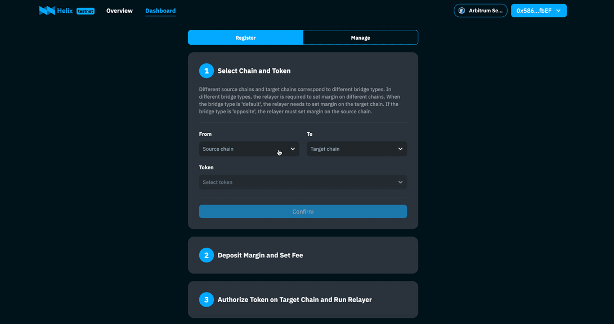

# Run a Relayer Node

## Overview

Helix is a completely open system where anyone can register as a Relayer without any barriers, contribute liquidity to the system, and earn profits. Before becoming a Relayer, you should have basic knowledge of blockchain, especially in the area of contract interaction. The code for Helix is open-source, and Relayers can either use the default code to run a Node or optimize the client according to their needs, promptly fixing any issues encountered.

Each Relayer entity is associated with two chains (the source chain and the target chain of the bridge) and a Token.

Prerequisites:

1. Prepare two accounts with same address on the two intended chains and deposit a certain amount of Token in each.
2. Register as a Relayer on the Helix UI, which involves staking a certain amount of collateral.
3. Pull the client code to your local environment, configure bridge information, and compile and run the code.

Now, let's run a Relayer Node (v2 opposite type for example) on the testnet using the example of (arbitrum-sepolia -> sepolia, USDC).

## Registration

Open the Helix UI and navigate to the [Relayer Dashboard](https://testnet.helixbridge.app/relayer/dashboard).

- **(1/3) Select Chain and Token**

  Choose the source chain as `arbitrum-sepolia`, the target chain as `sepolia`, and the Token as `USDC`. Click **Confirm** and the page will provide basic information about the bridge you are about to register. Here, you can find the bridge type is Opposite. Click **Next** to proceed.
  :::info{title=BridgeType}
  For LnBridge V2, there are only two types: Default and Opposite. The difference between these two types lies in the location of the Relayer's staked collateral. In Default type, the collateral is staked on the target chain, while in Opposite type, the collateral is staked on the source chain.
  :::

- **(2/3) Deposit Collateral & Set Fees**

  - Enter the desired amount of collateral and click **Confirm**. Subsequently, a wallet confirmation prompt will appear (this transaction is executed on the target chain). If your wallet is not currently connected to the target chain, you will be prompted to switch to the target chain before proceeding with the collateral pledge.
    :::info{title=Collateral}
    Helix does not impose any restrictions on the amount of collateral that a Relayer can stake; it is entirely specified by the Relayer. The more collateral pledged, the better the depth available for each transfer. However, it's important to note that higher collateral amounts correspond to increased pledge costs for the Relayer.
    :::

  - Entering the baseFee and liquidityFee rate. Click **Confirm**, and a wallet confirmation prompt will appear afterward(this transaction is executed on the source chain).
    :::info{title=Fee}
    The Relayer's final income per transfer is calculated as the `baseFee + liquidityFeeRate * Amount`, where Amount is the transfer amount.
    :::

- **(3/3) Approve**

  Authorize the contract to transfer Token `USDC` on the target chain. This authorization ensures that the `Relayer Client` can perform relay operations successfully on the target chain. Since there is also authorization in the second step, this step can be skipped if the authorized amount is sufficiently large.

After completing the registration, you can open the `Manage` tab to view the registered information. You will notice that the status of the relayer is `Offline` because you have not ye started the relayer client. Please note that there may be some delay in the synchronization of registration information.



## Run the client

Access the client code on [GitHub](https://github.com/helix-bridge/relayer) and pull it to your local machine.

### Configuration

The configuration information for the Relayer is stored in the file `.maintain/configure.json`.

```js
{
  "indexer": "https://apollo-test.helixbridge.app/graphql",
  "relayGasLimit": 600000,
  "rpcnodes": [
      {
          "name": "sepolia",
          "rpc": "https://rpc2.sepolia.org"
      },
      {
          "name": "arbitrum-sepolia",
          "rpc": "https://sepolia-rollup.arbitrum.io/rpc"
      }
  ],
  "bridges": [
      {
          "direction": "arbitrum-sepolia->sepolia",
          "encryptedPrivateKey": "<ENCRYPTED_PRIVATEKEY>",
          "feeLimit": 0.01,
          "reorgThreshold": 20,
          "bridgeType": "lnv2-opposite",
          "tokens": [
              {
                  "symbol": "usdc->usdc",
                  "swapRate": 2000
              }
          ]
      }
   ]
}
```

- **indexer**[option]: It's the second-layer index service introduced in this [section](https://docs.helixbridge.app/helixbridge/relayer_indexer) can be accessed through the following link.
  <table style={{ width: '80%' }}>
  <tr>
  <th style={{ width: '20%' }}>Network</th><th>URL</th>
  </tr>
  <tr>
  <td>Testnet</td><td>https://apollo-test.helixbridge.app/graphql</td>
  </tr>
  <tr>
  <td>Mainnet</td><td>https://apollo.helixbridge.app/graphql</td>
  </tr>
  </table>

- **relayGasLimit**[option]: The gas limit for the client to send the relay transaction. If not set, it will automatically estimate a reasonable value.
- **rpcnodes**: The list of information about the chains that the relayer needs, including name(must match the names defined in [section](http://localhost:8000/helixbridge/supported_chains)), chainId, and the URL for accessing the RPC node.
- **bridges**: The list of token bridge paths that can support multiple directions simultaneously. The fields include:
  - **direction**: Must match the names defined in fileld **chains**
  - **encryptedPrivateKey**: It's the relayer's encrypted private key, corresponding to the account registered during registration
    :::info{title=EncryptPrivateKey}
    Execute the command `yarn crypto`. Follow the prompts to input your password and private key. After pressing Enter, it will print the private key encrypted with the provided password. Then replace the `<ENCRYPTED_PRIVATEKEY>` in the configuration file with the encrypted private key obtained.
    :::
  - **feeLimit**: Controls the maximum cost of a relay operation, protecting the relayer from excessive gas fees
  - **reorgThreshold**: It's an assumption about the block confirmation of transactions initiated by users on the source chain – the larger, the safer
  - **bridgeType**: Indicates the type of bridge, currently taking values of `lnv2-default`, `lnv2-opposite`, and `lnv3`, consistent with the type displayed during relayer registration
  - **minProfit[optional]**: Relayer's minimum profit expected.
  - **maxProfit[optional]**: Relayer's maximum profit expected, both minProfit and maxProfix configured, then when the profit range jumps out of the interval [minProfit, maxProfit], it is automatically adjusted to (minProfit+maxProfit)/2.
  - **tokens**: List the addresses of token pairs on the source and target chains, as well as the exchange rate for the native token on the target chain.
    :::info{title=swapRate}
    Parameter swapRate is the conversion rate from the native token on the target chain to the transfer token. For example, the native token on Ethereum is ETH, and the token to be transferred is USDC, the conversion rate might be approximately 2500 at 16/01/2024. As prices fluctuate, the Relayer needs to periodically adjust this ratio.
    :::
    :::info{title=withdrawLiquidity}
    For the lnv3 bridge, the relayer can set two parameters in this section, including withdrawLiquidityAmountThreshold and withdrawLiquidityCountThreshold. The relayer client will check every 6 hours, and if either threshold is met, the relayer client will initiate the settlement process.
    :::
    :::info{title=useDynamicBaseFee}
    This parameter useDynamicBaseFee is only valid for LnbridgeV2 of type opposite, and needs to be used in conjunction with the minProfit parameter. When it is true, the relayer will query the cost of the current relay from the target chain in real time, and convert it into a dynamic cost signature on the source chain for the user.
    :::

### SafeWallet

You can also use safewallet to run relayer, just configure the following 3 parameters in the bridges field of the configuration file.

- **safeWalletAddress:**
  the wallet address, must exist both on source chain and target chain.
- **safeWalletUrl:**
  the safe wallet service url. eg. https://safe-transaction-goerli.safe.global
- **safeWalletRole:**
  the Role of the account, can be `signer` or `executor`, the `executor` will send execution transaction when there are enough signatures.

### Advanced Features
You can leverage the decentralized lending feature to achieve two purposes:
- Earn interest on account assets from the lending market during relayer idle times, reducing the cost of funds as a relayer.
- Provide relay services for an asset bridge without needing to hold that specific asset.

Currently, Helix relayer supports the AAVE lending pool. This feature is only supported for SafeWallet accounts. To use this feature, you need to create a SafeWallet with the same address across different networks and then transfer the tokens to this wallet.

For example, if you want to use the lending feature on Arbitrum, you will need to add configuration information similar to the example below.
```js
"rpcnodes": [
    {
        "name": "arbitrum",
        "rpc": "https://arb1.arbitrum.io/rpc",
        "lendMarket": [
          {
            "protocol": "aave",
            "healthFactorLimit": 3.0,
            "collaterals": [
                {
                    "symbol": "weth",
                    "autosupplyAmount": 0.2
                },
                {
                    "symbol": "usdt",
                    "autosupplyAmount": 2000
                }
            ],
            "tokens": [
                {
                    "symbol": "weth",
                    "minRepay": 0.0001,
                    "minReserved": 0
                }
            ]
          }
        ]
    },
]
```
- **lenMarket**: Represents the list of lending markets. 
- `healthFactorLimit` represents the lending risk factor, with a recommended value of 3. The larger the value, the safer it is, but the corresponding lending amount is lower.
- `collaterals` represents the collateral, and `autosupplyAmount` indicates the automatic collateral limit when the account has a balance and the collateral amount has not reached this value.
- `tokens` represent the lending tokens, and the client will also automatically repay the loan when the account has a balance of these assets.
- `Priority Usage` When a relay order is generated, the usage order of relay account assets is **Account Balance** > **Collateral Redemption** > **Lending Assets**. The redemption of collateral or the use of lending assets will only be enabled if they are in the configuration list.
- `Native Token Handling` The handling of any native token assets, including supply, withdraw, or lending, is represented by its wrapped token in configure file. However, the use of assets in the account remains as native tokens.

### Install & Run

After completing the configuration, you can execute the following commands one by one to compile and start the client:

```
>> yarn install
>> yarn build
>> yarn start
```

After the execution is complete, it will prompt you to enter a password. This password is the one used to encrypt the private key using `yarn crypto`.

```
>> yarn start
[Nest] 46997  - 01/16/2024, 5:42:11 PM     LOG [NestFactory] Starting Nest application...
[Nest] 46997  - 01/16/2024, 5:42:11 PM     LOG [InstanceLoader] UtilsModule dependencies initialized +49ms
[Nest] 46997  - 01/16/2024, 5:42:11 PM     LOG [InstanceLoader] DataworkerModule dependencies initialized +0ms
[Nest] 46997  - 01/16/2024, 5:42:11 PM     LOG [InstanceLoader] DiscoveryModule dependencies initialized +1ms
[Nest] 46997  - 01/16/2024, 5:42:11 PM     LOG [InstanceLoader] TasksModule dependencies initialized +0ms
[Nest] 46997  - 01/16/2024, 5:42:11 PM     LOG [InstanceLoader] ConfigHostModule dependencies initialized +1ms
[Nest] 46997  - 01/16/2024, 5:42:11 PM     LOG [InstanceLoader] AppModule dependencies initialized +0ms
[Nest] 46997  - 01/16/2024, 5:42:11 PM     LOG [InstanceLoader] ScheduleModule dependencies initialized +0ms
[Nest] 46997  - 01/16/2024, 5:42:11 PM     LOG [InstanceLoader] ConfigModule dependencies initialized +1ms
[Nest] 46997  - 01/16/2024, 5:42:11 PM     LOG [InstanceLoader] ConfigureModule dependencies initialized +1ms
[Nest] 46997  - 01/16/2024, 5:42:11 PM     LOG [InstanceLoader] RelayerModule dependencies initialized +1ms
[Nest] 46997  - 01/16/2024, 5:42:11 PM     LOG [RoutesResolver] AppController {/}: +6ms
[Nest] 46997  - 01/16/2024, 5:42:11 PM     LOG [RouterExplorer] Mapped {/, GET} route +3ms
[Nest] 46997  - 01/16/2024, 5:42:11 PM     LOG [dataworker] data worker started
[Nest] 46997  - 01/16/2024, 5:42:11 PM     LOG [relayer] relayer service start
Password:******
```

### Client Run Status

Return to the Relayer Dashboard page on the UI, enter the **Manage** page, and you will observe that the status of your Relayer has changed to `Online`.

## Tips

If the token bridge is the `Default` type, there will be slight differences in the registration process, and in the client's configuration, the bridgeType should be modified to lnv2-default. Or if the token bridge is the `v3` type, the bridgeType should be modified to `lnv3`.
